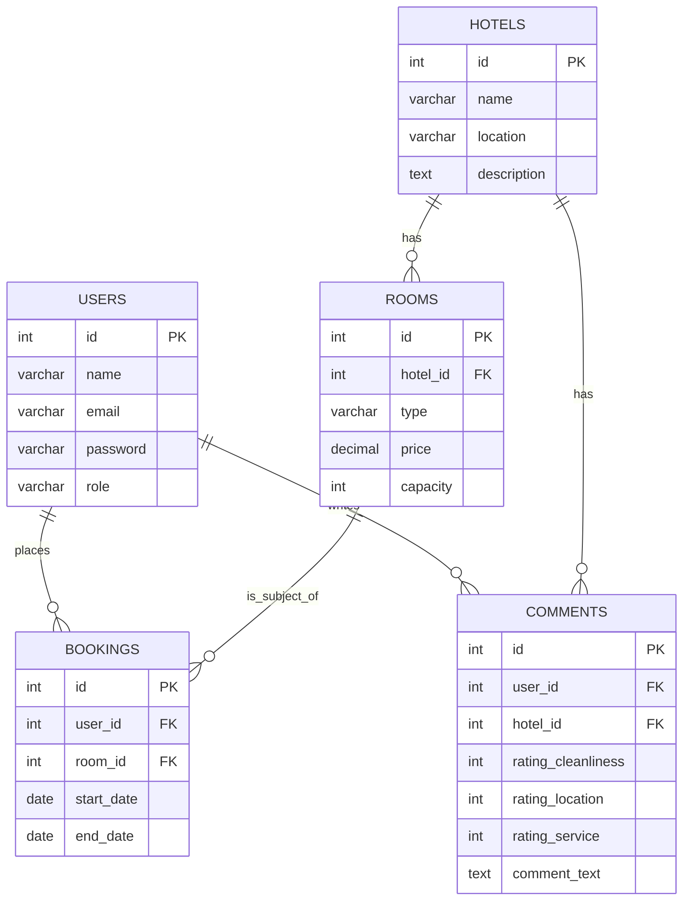

# Hotel Booking System

This project is a microservices-based hotel booking system.

## Services

The system is composed of the following microservices:

-   **API Gateway**: The single entry point for all client requests.
-   **Hotel Admin Service**: For hotel staff to manage hotels, rooms, and availability.
-   **Hotel Search Service**: For users to search for available hotels.
-   **Book Hotel Service**: For users to book hotels.
-   **Hotel Comments Service**: For users to leave and view comments about hotels.
-   **Notification Service**: Sends notifications to admins and users.
-   **AI Agent Service**: A chat-based interface for interacting with the system.

## Tech Stack

-   **Backend**: Node.js, Express.js
-   **Databases**: PostgreSQL, MongoDB, Redis
-   **Messaging**: RabbitMQ
-   **Containerization**: Docker, Docker Compose

## Design Decisions

_A brief overview of the architectural and design choices made during the development of the system._

## Challenges

_A description of any challenges faced during development and how they were overcome._

## Entity-Relationship Diagram (ERD)

_The ERD for the PostgreSQL database will be included here._



## Running the Project

1.  Clone the repository:
    ```bash
    git clone <repository-url>
    ```
2.  Navigate to the project directory:
    ```bash
    cd hotel-booking-system
    ```
3.  Start the services:
    ```bash
    docker-compose up --build
    ```

## API Endpoints & Deployment URLs

_A list of all the API endpoints and where they are deployed._

-   **API Gateway**: http://localhost:3000
-   **Hotel Admin Service**: http://localhost:3001
-   **Hotel Search Service**: http://localhost:3002
-   **Hotel Booking Service**: http://localhost:3003
-   **Hotel Comments Service**: http://localhost:3004
-   **AI Agent Service**: http://localhost:3005
-   **RabbitMQ Management**: http://localhost:15672

_Note: This is a placeholder README and will be updated as the project progresses._ 